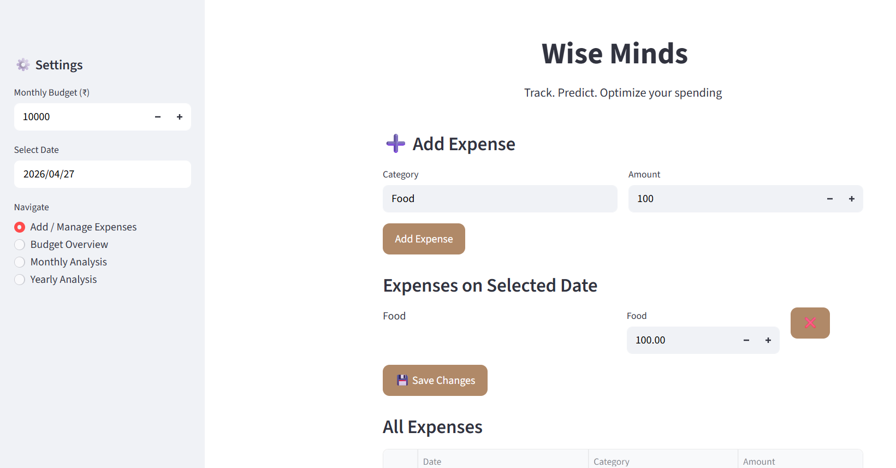
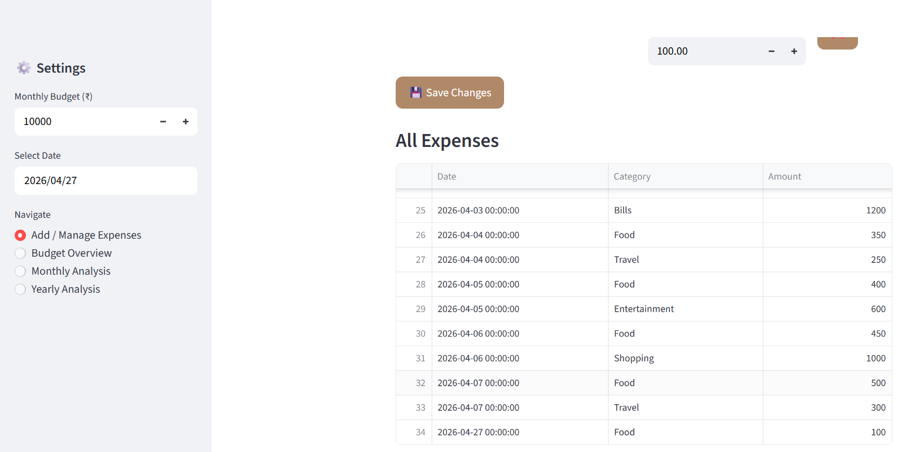
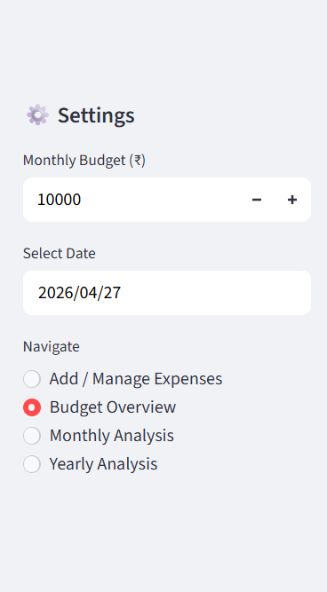
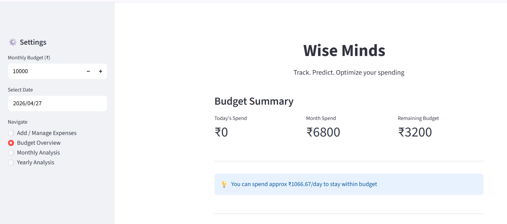
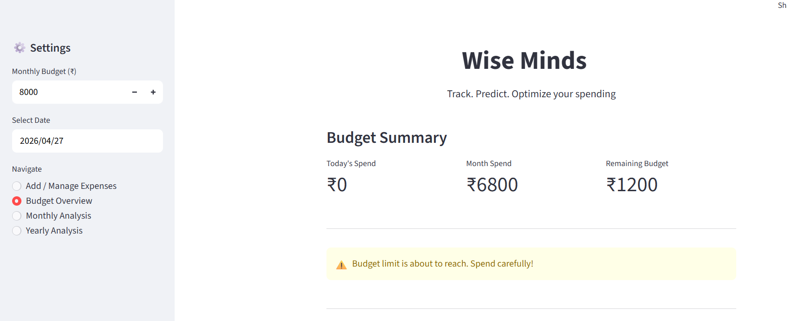
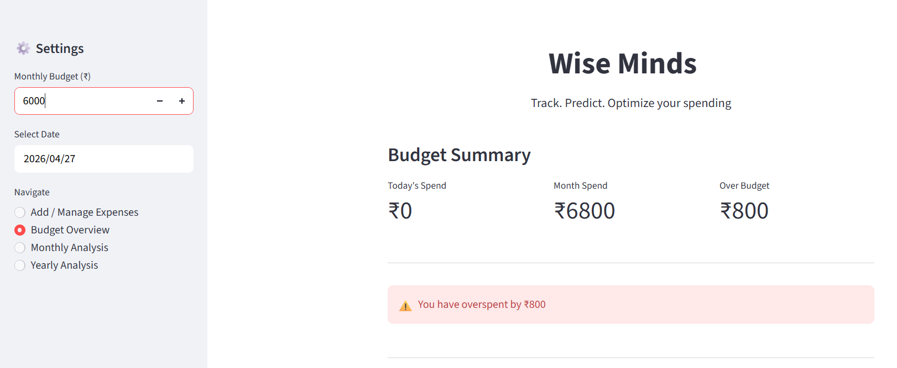
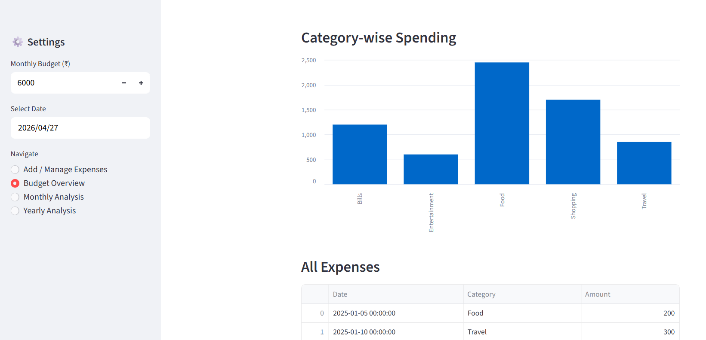
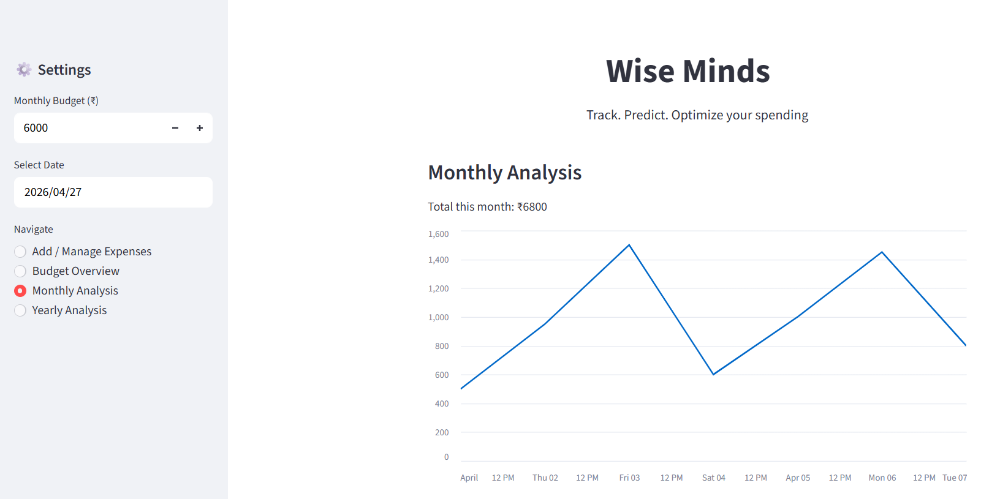
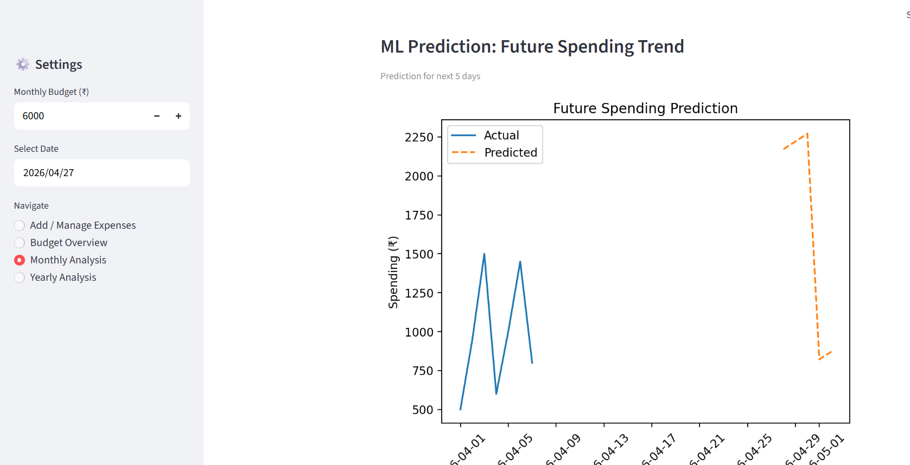
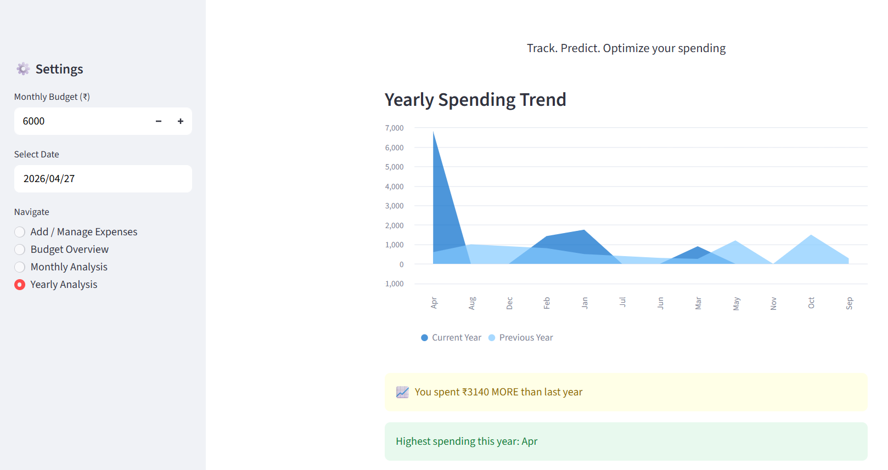

# Wise Minds — Smart Expense Tracker & Predictor

Wise Minds is an intelligent expense tracking web application that helps users monitor daily spending, stay within budget, and make data-driven financial decisions using predictive analytics.

---

## Features

###  Expense Management

* Add, edit, and delete daily expenses
* Support for multiple categories per day (Food, Travel, etc.)
* Prevents duplicate or accidental double entries
* Option to manually select dates (for past entries)

###  Budget Tracking

* Monthly budget input
* Real-time calculation of:

  * Today's spending
  * Monthly spending
  * Remaining budget
* Smart alerts:

  *  Budget approaching limit
  *  Over-budget detection
  *  Money saved (if under budget)

###  Monthly Analysis

* Daily spending visualization (line chart)
* Total monthly expense calculation
* **ML-based prediction for next 5 days**
* Intelligent spending suggestions to stay within budget

###  Yearly Analysis

* Month-wise expense breakdown (Jan–Dec)
* Clean visualization for yearly trends
* Optional comparison with previous year (if data available)

###  Smart Prediction

* Uses **Linear Regression** to forecast future spending
* Predicts next 5 days based on current month trends
* Prevents unrealistic outputs (e.g., negative predictions)

###  Data Visualization

* Interactive charts using Streamlit & Matplotlib
* Daily, monthly, and yearly insights
* Category-wise breakdown

---

##  Tech Stack

* **Frontend & Backend:** Streamlit
* **Data Processing:** Pandas, NumPy
* **Machine Learning:** Scikit-learn (Linear Regression)
* **Visualization:** Matplotlib, Streamlit Charts
* **Storage:** CSV-based data persistence

---

##  Key Highlights

* Clean and intuitive UI (responsive for desktop & mobile)
* Real-time budget tracking with actionable insights
* Beginner-friendly ML integration with real-world use case
* Fully deployable web application

---

##  Project Structure

```
expense-tracker-ml/
│
├── app.py              # Main Streamlit app
├── expenses.csv        # Data storage
├── LogoTracker.png     # App logo
├── requirements.txt    # Dependencies
└── README.md
```

---

##  Run Locally

```bash
pip install -r requirements.txt
streamlit run app.py
```

---

##  Live Demo

 
 https://expense-tracker-ml-ahawdnx6rhansxudv5t5fp.streamlit.app/

---

##  Future Improvements

* User authentication (login/signup)
* Cloud database integration (Firebase / PostgreSQL)
* Advanced ML models for better prediction
* Weekly trend analysis
* Export reports (PDF/Excel)

---

##  Screenshots
### 1) Adding expense in the data and showing record of data added (Can remove or make changes in added expense too)
<div align="center">
  
  
</div>

### 2)   Navigation & Controls
Easily switch between Budget, Monthly, and Yearly insights while selecting custom dates for accurate tracking.
<div align="center">
  
</div>


### 3) Budget Overview — Stay in Control
Get daily spending suggestions to remain within your monthly budget.
<div align="center">
  
</div>

###  Budget Alert
Smart warnings notify when spending is approaching the defined budget limit.
<div align="center">
  
</div>

###  Over Budget Detection
Instant feedback when spending exceeds budget, helping you adjust financial decisions.
<div align="center">
  
</div>

### 4) Category-wise Insights
Visual breakdown of spending across categories for better financial awareness.
<div align="center">
  
</div>

### 5) Monthly Analysis
Track daily spending trends with clear visualizations for the selected month.
<div align="center">
  
</div>

### 6) Spending Prediction (Next 5 Days)
Forecast upcoming expenses using machine learning based on current spending patterns.
<div align="center">
  
</div>

### 7) Yearly Overview & Comparison
Analyze month-wise trends and compare spending across different years.
<div align="center">
  
</div>


---

##  Author

**Harmann Kaur**

---

##  Inspiration

Built to simplify personal finance management and demonstrate practical application of machine learning in real-world scenarios.

---
